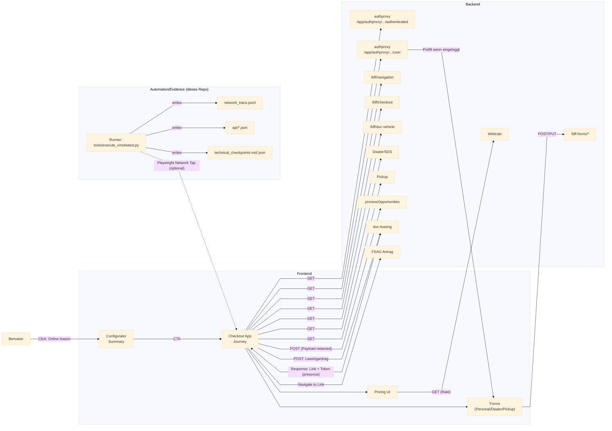

# Datenfluss: Konfigurator → Checkout → Backends

Ziel: Den *tatsächlichen* Datenfluss zwischen Frontend und den wichtigsten Backend-Services im eCom/BTO-Checkout nachvollziehbar darstellen.

Hinweise:
- URLs/Query-Parameter/Token werden in unseren Artefakten redacted (Host+Path), keine Auth/Cookies.
- `processOpportunities` und `duc-leasing` werden typischerweise erst in späteren Checkout-Schritten getriggert (z.B. beim Klick auf „Zum Leasingantrag“).
- Optional: Wenn der Benutzer eingeloggt/registriert ist, kann ein Auth/Identity-Service Profil-/Stammdaten liefern (Prefill für Formularfelder).

## Mapping zu unseren Artefakten
- `network_trace.jsonl`: korrelierte Requests/Responses (inkl. Statuscodes) pro Run.
- `api/*.json`: redacted JSON-Evidence für ausgewählte Endpoints (z.B. `duc-leasing`, `processOpportunities`, Dealer/Pickup/Vehicle, wenn getriggert).
- `technical_checkpoints.md/.json`: maschinenlesbare/lesbare Auswertung (2xx/5xx, Treffer pro Bucket, Link/Token-Presence, etc.).
